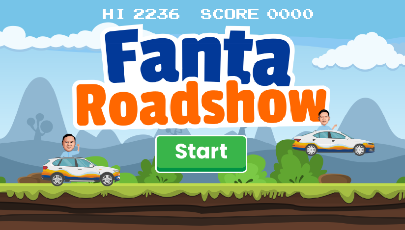

# 🇮🇩 🚗 TKN FANTA Running

**TKN FANTA Running** is a 2D endless runner game inspired by the classic Chrome Dino game. Built using **Java** and **Object-Oriented Programming (OOP)** principles, the game challenges players to jump over obstacles and survive as long as possible while the speed increases.

This project was developed as part of my internship program in TKN FANTA. It was made to be played during an event that was going to be held by the company. This was during the 2024 Indonesia president elections.

The theme being Indonesias, it uses the (current) president and vice president of Indonesia as characters, and a background filled with Indonesian famous landscapes to promote both the election and Indonesia as a country.

---

## 🎮 Gameplay Overview

- Tap the `Spacebar` to jump over incoming obstacles.
- The game gets faster the longer you survive!
- Score increases the longer you stay alive.

---

## 🧰 Technologies Used

- **Java**
- **Object-Oriented Programming (OOP)**
- **2D Animation**
- **Game Loop Mechanics**
- **Simple GUI with Java Swing/JavaFX (depending on your setup)**

---

## 🚀 Getting Started

1. **Clone the repository**
   ```bash
   git clone https://github.com/yourusername/yona-runner.git
## Screenshots


